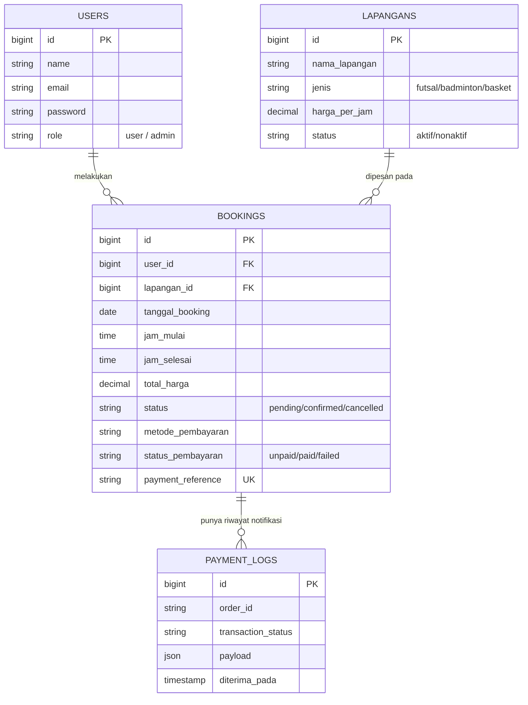
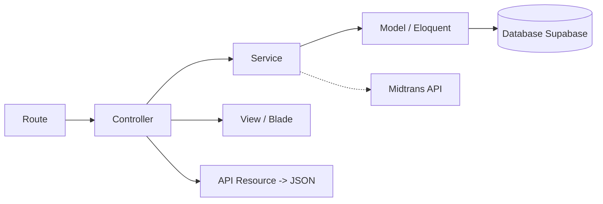
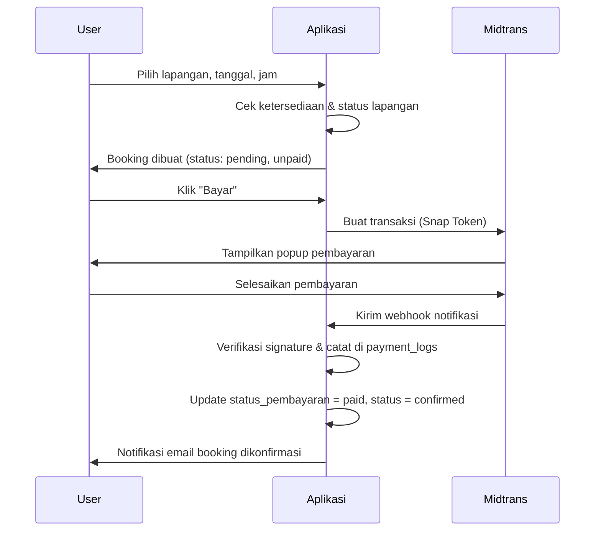

# Booking Lapang

Aplikasi booking lapang olahraga (futsal, badminton, basket) dengan pembayaran online (Midtrans Snap), dibangun dengan Laravel + PostgreSQL (Supabase).

## Tech Stack

- **Backend**: Laravel 13
- **Database**: PostgreSQL (Supabase)
- **Payment Gateway**: Midtrans Snap (Sandbox)
- **Autentikasi API**: Laravel Sanctum
- **Deployment**: Vercel (community runtime `vercel-php`)
- **Frontend**: Blade + Tailwind CSS
- **Grafik dashboard**: Chart.js

## Instalasi Lokal

1. Clone repository ini
   ```
   git clone https://github.com/Rora-1dain/BookingLapang.git
   cd BookingLapang/booking-lapang
   ```
2. Install dependency PHP
   ```
   composer install
   ```
3. Install dependency frontend
   ```
   npm install
   npm run build
   ```
4. Copy `.env.example` menjadi `.env`, isi kredensial database & Midtrans
   ```
   copy .env.example .env
   ```
5. Generate application key
   ```
   php artisan key:generate
   ```
6. Jalankan migration dan seeder
   ```
   php artisan migrate --seed
   ```
7. Jalankan server lokal
   ```
   php artisan serve
   ```

## Environment Variable yang Dibutuhkan

| Variabel | Keterangan |
|---|---|
| `APP_KEY` | Kunci enkripsi aplikasi, generate dengan `php artisan key:generate` |
| `APP_ENV` | `local` untuk development, `production` untuk production |
| `APP_DEBUG` | `true` di lokal, **harus** `false` di production |
| `DB_CONNECTION` | `pgsql` |
| `DB_HOST` | Host database Supabase (Session mode port 5432 untuk migration, Transaction mode/PgBouncer port 6543 untuk aplikasi berjalan) |
| `DB_PORT` | `5432` (migration) atau `6543` (aplikasi/serverless) |
| `DB_DATABASE` | `postgres` |
| `DB_USERNAME` | Username Supabase |
| `DB_PASSWORD` | Password Supabase |
| `MAIL_MAILER` | `log` untuk development (email dicek di `storage/logs/laravel.log`) |
| `MIDTRANS_SERVER_KEY` | Server key dari dashboard Midtrans Sandbox |
| `MIDTRANS_CLIENT_KEY` | Client key dari dashboard Midtrans Sandbox |
| `MIDTRANS_IS_PRODUCTION` | `false` untuk Sandbox |
| `SESSION_DRIVER` | `database` (wajib `database`, bukan `file`, saat deploy ke Vercel karena filesystem read-only) |
| `CACHE_STORE` | `database` (lokal) atau `redis` (production, trafik tinggi) |
| `QUEUE_CONNECTION` | `database` |

## Struktur Database (ERD)



## Diagram Arsitektur Aplikasi



Pola yang dipakai project ini konsisten di seluruh fitur: **Route** menerima request dan mengarahkannya ke **Controller**, **Controller** menangani validasi input serta memanggil **Service** untuk seluruh logika bisnis (cek ketersediaan jadwal, hitung harga, proses pembayaran, dsb), **Service** berinteraksi dengan **Model/Eloquent** untuk membaca/menulis data ke database, dan hasilnya dikembalikan ke Controller untuk ditampilkan lewat **View** (web) atau **API Resource** (JSON untuk aplikasi mobile/eksternal).

## Alur Bisnis Utama



## Dokumentasi Tambahan

- Koleksi Postman lengkap: [`postman_collection.json`](./docs/postman_collection.json)
- Riwayat perubahan project: [`CHANGELOG.md`](./CHANGELOG.md)
- Daftar isu yang belum diperbaiki: [`known-issues.md`](./known-issues.md)

## Tim

| Nama | Fokus Utama |
|---|---|
| Ardan | Model, View, Validasi, Notifikasi, API Resource, Struktur Data, Dokumentasi |
| Bintang | Service, Konfirmasi Admin, Export Laporan, Integrasi Midtrans, Refactoring |
| Revano | Controller, Integrasi, Otorisasi, Queue, Autentikasi API, Deployment, QA |

Project PKL SMK Telkom Bandung di CV Artechmis Solution.
